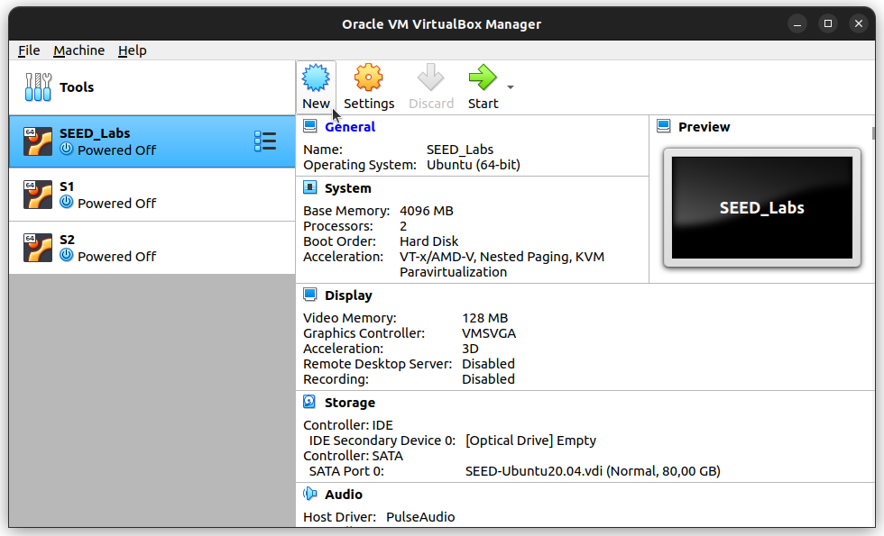
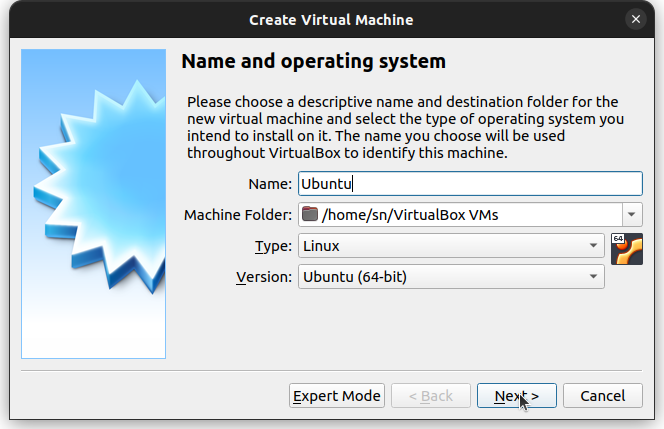
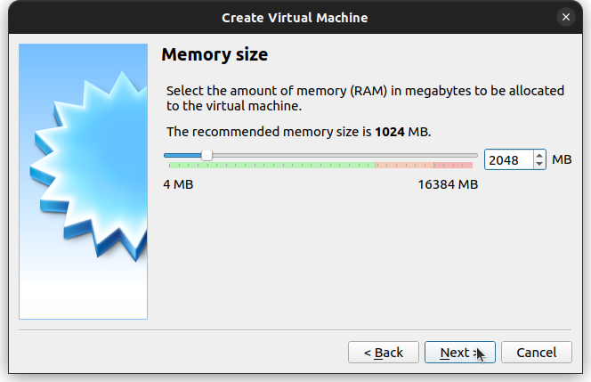
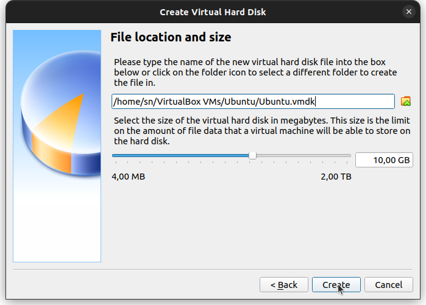
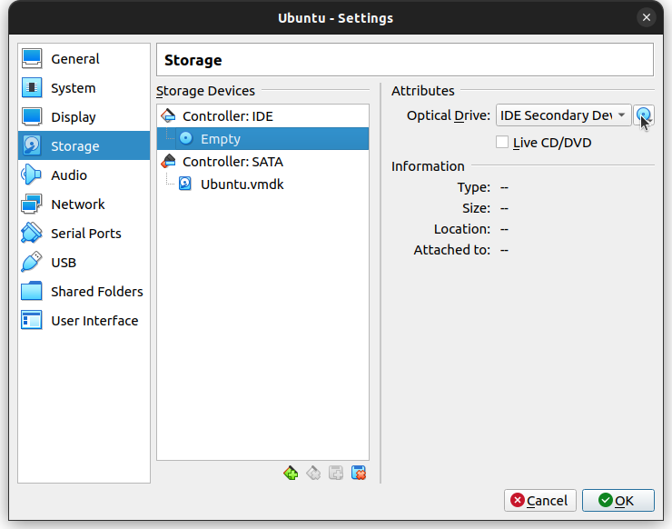
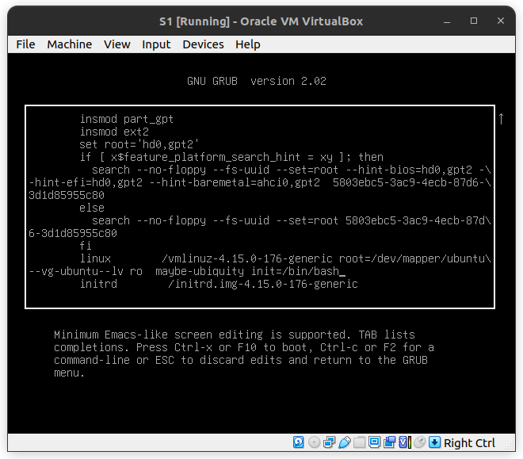

# Introduction to Linux
## Installation
1. Tải và cài đặt [VirtualBox](https://www.virtualbox.org/wiki/Downloads) về máy

2. Tạo máy ảo bằng cách chọn **Machine** -> **New (Ctrl + N)**

<p align="center">
  
</p>

3. Đặt tên, chọn vị trí lưu máy ảo và chọn hệ điều hành (Ubuntu 64-bit)

<p align="center">
  
</p>

4. Chọn lượng bộ nhớ RAM chia cho máy ảo

<p align="center">
  
</p>

5. Tạo ổ đĩa ảo, chọn loại ổ đĩa, kiểu lưu trữ, dung lượng (có thể nhất **Next** để chọn default)

<p align="center">
  
</p>

6. Từ máy ảo chọn **Settings** -> **Storage** -> Trỏ Optical Drive đên file ISO để bắt đầu cài đặt

<p align="center">
  
</p>

(Updating...)

## Reset Linux password by rescue mode
1. Từ menu grub, gõ `e` để chỉnh sửa, thêm `init=\bin\bash` vào cuối dòng linux và gõ **Ctrl + X** để boot

<p align="center">
  
</p>

2. Sử dụng 2 lệnh sau để thiết lập lại mật khẩu

```
# mount -o rw,remount \     # mount lại ổ cứng với quyển rw
# passwd USER               # thay user bằng tên người dùng muổn đổi mật khẩu
```

### Bật menu grub trên Linux
1. Mở file grub
```
$ sudo nano /etc/default/grub
```
2. Đảm bảo STYLE là countdown và TIMEOUT khác 0
```
GRUB_TIMEOUT_STYLE=countdown
GRUB_TIMEOUT=-1         # Chờ đến khi người dùng chọn
```

## Package Manager (apt / apt-get)
| Lệnh | Ý nghĩa |
| --- | --- |
| update | tải xuống thông tin các gói từ các source được cài đặt |
| upgrade | cài đặt các bản nâng cấp của các gói được cài đặt trên máy |
| full-upgrade | tương tự upgrade, nhưng sẽ xóa gói cũ đi trước |
| install, reinstall, remove, purge | cài đặt gói (install, reinstall), xóa gói (remove, purge) |
| autoremove | xóa những gói được tự động cài vào nhưng không còn nằm trong dependencies của bất kì gói nào |
| satisfy | 
| search | tìm các gói dựa trên **regex** truyền vào |
| show | hiển thị thông tin của một gói cụ thể |
| list | liệt kê các gói |
| edit-sources |

## apt remove vs apt purge
- remove : chỉ xóa gói
- purge : xóa gói và tất cả những gì có liên quan đến gói

## Vim tutorial

### Điều hướng
            ^
            k                   Sử dụng các phím h, j, k, l để
    < h            l >          điều hướng trong Normal Mode, để
            j                   trở về Normal Mode, nhấn phím ESC
            v

### Một số lệnh thưởng dùng
| Thao tác | Ý nghĩa |
| --- | --- |
| :q | thoát Vim |
| :q! | thoát và không lưu thay đổi |
| :wq | thoát và lưu thay đổi |
| i | insertion mode |
| a | appending mode |
| x | xóa kí tự |
| dd | xóa dòng, có thể sử dụng 2dd để xóa 2 dòng, ndd để xóa n dòng |
| dw | xóa từ đến vị trí bắt đầu 1 từ mới, có thể sử dụng d2w để xóa 2 từ, dnw để xóa n từ |
| de | xóa đến vị trí kết thúc của từ hiện tại, xóa nhiều từ tương tự dw |
| d$ | xóa đến hết dòng hiện tại |
| u | undo |
| v | select |
| y | copy |
| p | paste |